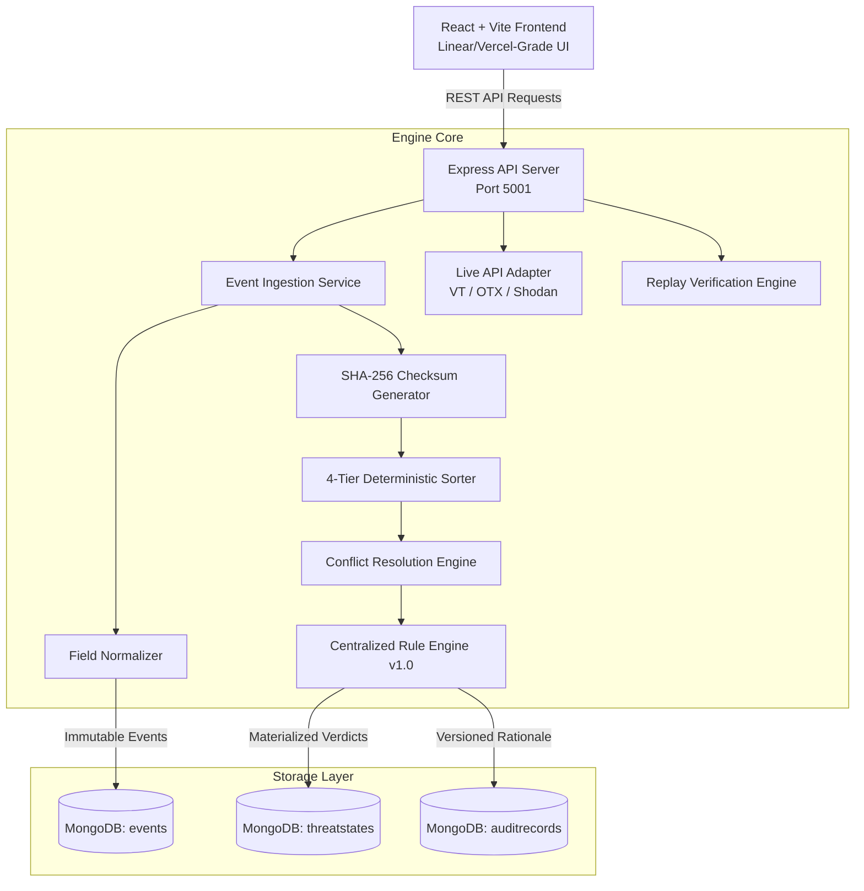
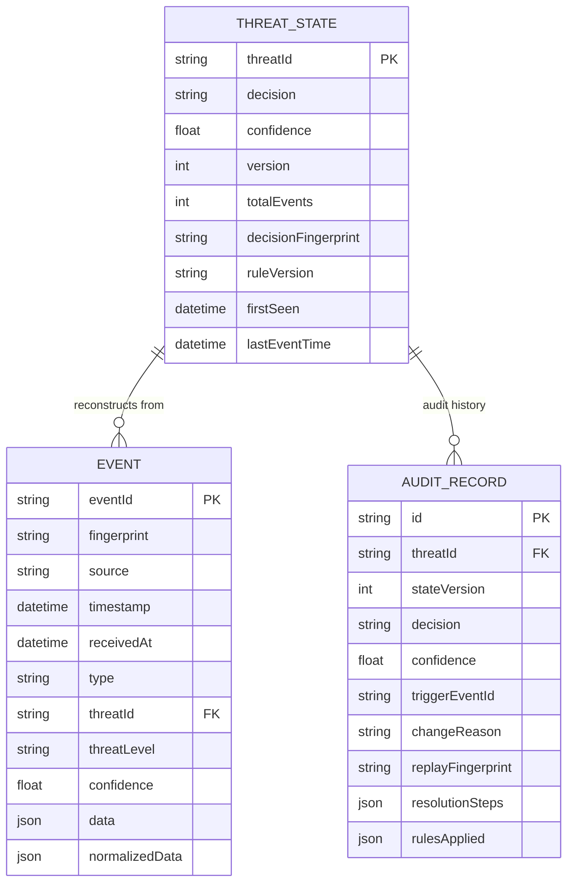
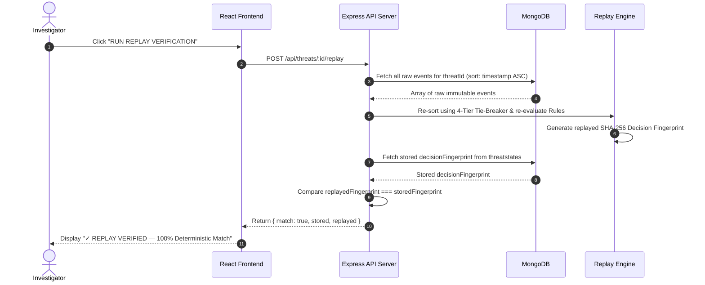

# 🛡️ ThreatChronicle — Production-Grade Cybersecurity Investigation & Deterministic Threat Engine

> Production-grade cybersecurity investigation platform and deterministic threat correlation engine built with **Node.js**, **Express**, **MongoDB**, **Mongoose**, **React**, **Vite**, **Motion**, and live threat intelligence APIs (**VirusTotal v3**, **AlienVault OTX**, **Shodan**).

---

## Table of Contents
1. [Architecture Overview & Diagrams](#1-architecture-overview--diagrams)
   - [A. High-Level System Architecture](#a-high-level-system-architecture)
   - [B. Database Data Model & Entity Structure](#b-database-data-model--entity-structure)
   - [C. Deterministic Replay Verification Sequence](#c-deterministic-replay-verification-sequence)
2. [Deterministic State Engine & Precedence Matrix](#2-deterministic-state-engine--precedence-matrix)
3. [Key Architectural Patterns](#3-key-architectural-patterns)
4. [Environment Variables Configuration](#4-environment-variables-configuration)
5. [Local Development Setup Guide](#5-local-development-setup-guide)
6. [Project Directory Structure](#6-project-directory-structure)
7. [REST API Reference](#7-rest-api-reference)
8. [Pre-Configured Edge-Case Test Fixtures](#8-pre-configured-edge-case-test-fixtures)

---

## 1. Architecture Overview & Diagrams

The system follows a decoupled Single-Page Application (SPA) and REST API backend architecture, emphasizing data safety, immutable event-sourcing, deterministic conflict resolution, live threat intelligence adapters, and 100% verifiable replay consistency.

### A. High-Level System Architecture



### B. Database Data Model & Entity Structure



### C. Deterministic Replay Verification Sequence

When an investigator clicks **"RUN REPLAY VERIFICATION"**, the system proves decision integrity by reconstructing state purely from raw events:



---

## 2. Deterministic State Engine & Precedence Matrix

ThreatChronicle resolves multi-source telemetry conflicts using a strict **Source Reliability Hierarchy** combined with a **4-Tier Sorting Algorithm**:

### Source Precedence Ranking

| Source Name | Reliability Rank | Description |
| :--- | :---: | :--- |
| **`AlienVault OTX`** | **`Rank 3` (Highest)** | Primary Threat Intelligence Feeds & Curated IOC Pulses |
| **`VirusTotal v3`** / **`EDR`** | **`Rank 2` (Medium)** | Multi-engine antivirus scans & endpoint detection logs |
| **`AI Threat Report`** | **`Rank 1` (Lowest)** | LLM/AI probabilistic risk assessments |

### 4-Tier Deterministic Sorting Order
When evaluating telemetry for a threat, events are sorted strictly in this sequence:
1. **`timestamp ASC`**: Historical occurrence time in the wild.
2. **`sourceRank DESC`**: Source authority rank (`AlienVault: 3` > `VirusTotal/EDR: 2` > `AI Report: 1`).
3. **`confidence DESC`**: Signal confidence percentage ($0.00$ to $1.00$).
4. **`eventId / fingerprint ASC`**: Lexicographical tie-breaker guaranteeing identical evaluation order across all execution environments.

### Correlation Decision Rules (`RULE_VERSION_v1.0`)

| Decision | Condition / Trigger |
| :--- | :--- |
| **`BLOCKED`** | Primary `AlienVault` IOC report with `HIGH`/`CRITICAL` threat level OR aggregate score $\ge 0.70$. |
| **`SUSPICIOUS`** | Medium severity telemetry OR aggregate score $\ge 0.40$. |
| **`MONITOR`** | Low severity telemetry OR baseline active monitoring. |
| **`CLEAN`** | Clean scan telemetry with zero threat detections. |

---

## 3. Key Architectural Patterns

- **Immutable Event Store**: Raw events stored in `events` are append-only. Received data is never overwritten or deleted.
- **SHA-256 Fingerprint Deduplication**: Every event payload is hashed using $\text{SHA256}(\text{source} \mid \text{threatId} \mid \text{timestamp} \mid \text{type})$. Duplicate submissions are rejected (`accepted: false, duplicate: true`).
- **Late-Event Out-of-Order Handling**: When a historical event arrives out-of-order, the engine inserts it into the timeline, re-runs state reconstruction, increments the state version (`v1` $\rightarrow$ `v2`), tags the event with `⚡ LATE EVENT`, and logs a complete audit diff.
- **Live Multi-API Adapters**: Real-time integration with VirusTotal v3, AlienVault OTX, and Shodan REST APIs using keys configured in `.env`.
- **Executive PDF / TXT Report Generation**: 1-click generation of styled executive security reports (`PDF`) and plaintext audit ledgers (`TXT`).

---

## 4. Environment Variables Configuration

> [!IMPORTANT]
> Never commit actual secret credentials or private API keys to source control. Use environment configuration files (`.env`) to manage environment secrets.

### Backend (`backend/.env`)

| Variable | Required | Description | Example |
| :--- | :---: | :--- | :--- |
| `PORT` | Yes | Port for Express REST API server | `5001` |
| `NODE_ENV` | Yes | Node environment (`development` / `production`) | `development` |
| `MONGO_URI` | Yes | MongoDB connection string | `mongodb://127.0.0.1:27017/threatchronicle` |
| `VT_API_KEY` | Optional | VirusTotal API v3 Key for live threat lookup | `b2c02387...` |
| `OTX_API_KEY` | Optional | AlienVault OTX REST API Key for live pulse lookup | `6c9644c7...` |
| `SHODAN_API_KEY` | Optional | Shodan API Key for host port/vuln scan | `T2hsRnT1...` |

---

## 5. Local Development Setup Guide

### Prerequisites
- **Node.js**: `v18.0.0` or higher
- **npm**: `v9.0.0` or higher
- **MongoDB**: Local MongoDB instance running on `localhost:27017`

### Step 1: Clone Repository & Setup Environment Files

```bash
# Clone the repository
git clone https://github.com/Sridharsri67/ThreatChronicle.git
cd ThreatChronicle

# Setup backend environment file
cat <<EOT > backend/.env
PORT=5001
MONGO_URI=mongodb://127.0.0.1:27017/threatchronicle
NODE_ENV=development
VT_API_KEY=your_virustotal_key_here
OTX_API_KEY=your_alienvault_key_here
SHODAN_API_KEY=your_shodan_key_here
EOT
```

### Step 2: Backend Setup & Automated Test Suite

```bash
# Navigate to backend directory
cd backend

# Install dependencies
npm install

# Run automated unit, integration, and replay benchmark test suite
npm test
```

### Step 3: Frontend Setup

```bash
# Navigate to frontend directory (from project root)
cd ../frontend

# Install dependencies
npm install
```

### Step 4: Run Development Servers

**In Terminal 1 (Backend API)**:
```bash
cd backend
npm start
# (API Server running on http://localhost:5001)
```

**In Terminal 2 (Frontend Client)**:
```bash
cd frontend
npm run dev
# (React Single Page App running on http://localhost:5173)
```

---

## 6. Project Directory Structure

```text
ThreatChronicle/
├── backend/
│   ├── src/
│   │   ├── config/         # MongoDB database connection setup
│   │   ├── controllers/    # HTTP request handlers (Event, Threat, Replay, Fixtures, Metrics)
│   │   ├── engine/         # 4-tier sorter, resolver, rules v1.0, state machine
│   │   ├── models/         # Mongoose schemas (Event, ThreatState, AuditRecord)
│   │   ├── routes/         # Express API route definitions
│   │   ├── services/       # Ingestion, state, replay, & live API adapter services
│   │   ├── utils/          # Canonicalizer & SHA-256 fingerprint generator
│   │   ├── validators/     # Input validation middleware
│   │   ├── app.js          # Express app setup & CORS policy
│   │   └── server.js       # Node.js server entrypoint
│   ├── tests/              # Unit, integration, replay, & benchmark test suites
│   ├── .env                # Backend environment configuration
│   └── package.json
├── frontend/
│   ├── src/
│   │   ├── components/
│   │   │   ├── audit/      # Versioned Audit History Timeline
│   │   │   ├── conflict/   # Multi-Source Conflict Resolution Panel
│   │   │   ├── dashboard/  # Engine Performance Metrics Panel
│   │   │   ├── decision/   # Active Threat Decision Hero Card
│   │   │   ├── layout/     # App Header & Command Palette (⌘ K)
│   │   │   ├── replay/     # Signature Replay Verification Console
│   │   │   ├── simulation/ # Event Simulation Lab & Live API Fetch Bar
│   │   │   ├── threat/     # Sidebar Investigation Queue & Items
│   │   │   └── timeline/   # Chronological Telemetry Stream & Event Cards
│   │   ├── services/       # Centralized API service layer
│   │   ├── App.jsx         # Main application shell
│   │   ├── index.css       # Black-first design tokens & CSS rules
│   │   └── main.jsx        # React DOM entrypoint
│   ├── index.html
│   ├── vite.config.js
│   └── package.json
├── fixtures/               # 8 Edge-case JSON fixture streams
└── README.md               # Master Architecture Handbook
```

---

## 7. REST API Reference

### Event Ingestion & Live Intelligence
- `POST /api/events` — Ingest raw telemetry event or batch array.
- `POST /api/events/fetch-live` — Query VirusTotal, AlienVault OTX, and Shodan live REST APIs.
- `GET /api/events` — Retrieve paginated raw event log.

### Threat State & Investigation
- `GET /api/threats` — List threats queue (Supports `decision` and `search` filters).
- `GET /api/threats/:id` — Retrieve active decision, raw events, and versioned audit trail.
- `GET /api/threats/:id/report?format=pdf|txt|json` — Download styled Executive PDF / TXT investigation report.
- `POST /api/threats/:id/replay` — Execute deterministic replay verification & check SHA-256 checksums.

### Fixtures & Metrics
- `POST /api/fixtures/load` — Load preset test fixture streams (`conflict`, `late-event`, `duplicate`, `all`).
- `GET /api/metrics` — Retrieve engine throughput and operational health statistics.

---

## 8. Pre-Configured Edge-Case Test Fixtures

| Fixture Name | Target Edge-Case Description |
| :--- | :--- |
| **`duplicate`** | Tests SHA-256 event fingerprinting & duplicate rejection. |
| **`late-event`** | Tests historical out-of-order event insertion & timeline reconstruction (`⚡ LATE EVENT`). |
| **`conflict`** | Tests multi-source divergence (`AlienVault: 3` vs `VirusTotal: 2` vs `AI Report: 1`). |
| **`invalidation`** | Tests threat mitigation when clean scan telemetry invalidates prior risk state. |
| **`out-of-order`** | Tests state consistency when events arrive in reverse chronological order. |
| **`same-timestamp`** | Tests tie-breaking when two conflicting events share the exact same timestamp. |
| **`ai-report`** | Tests handling of AI/LLM threat report intelligence feeds. |
| **`mixed-incident`** | Multi-source complex incident simulation. |

---

## 📄 License
Distributed under the MIT License.
